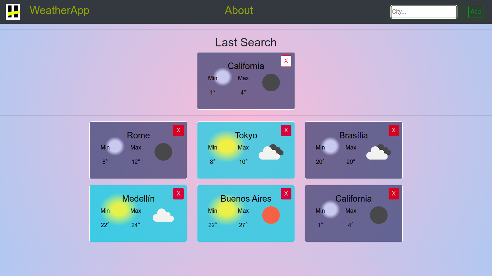
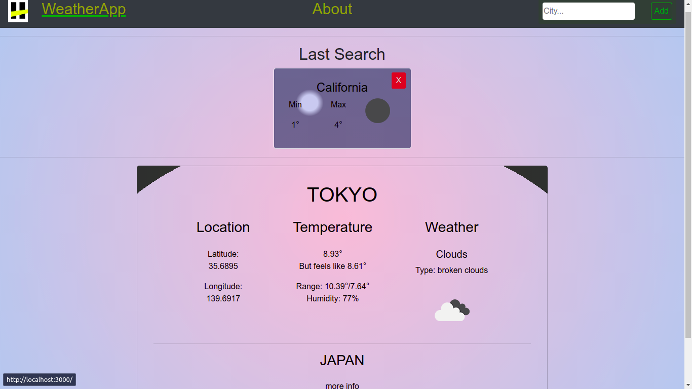
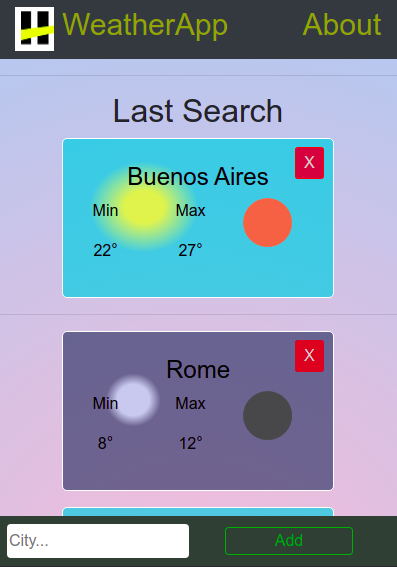
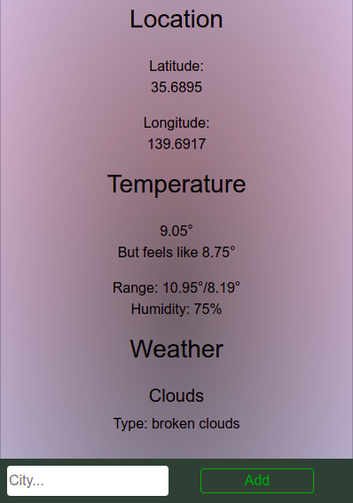
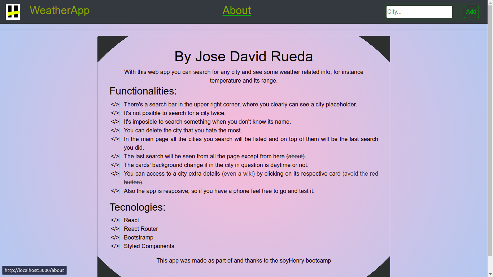

# WeatherApp

This project was made as part of and thanks to the soyHenry bootcamp, a really good way to introduce technologies and concepts like React, Routing, Styled Components, API usage.

_The API in question is [OpenWheather](https://openweathermap.org/api)_

## Try it out

1) Clone this respository
2) Open the terminal in the cloned folder
3) And run the command line, `npm install` then, `npm start`
4) Or just click [here...](https://weatherappjse.netlify.app)

## Project Screens

### Home redirect Cities
------

------
### City Details
------

------
### Responsiveness
------
 || 
------
### About / functionalities
------

